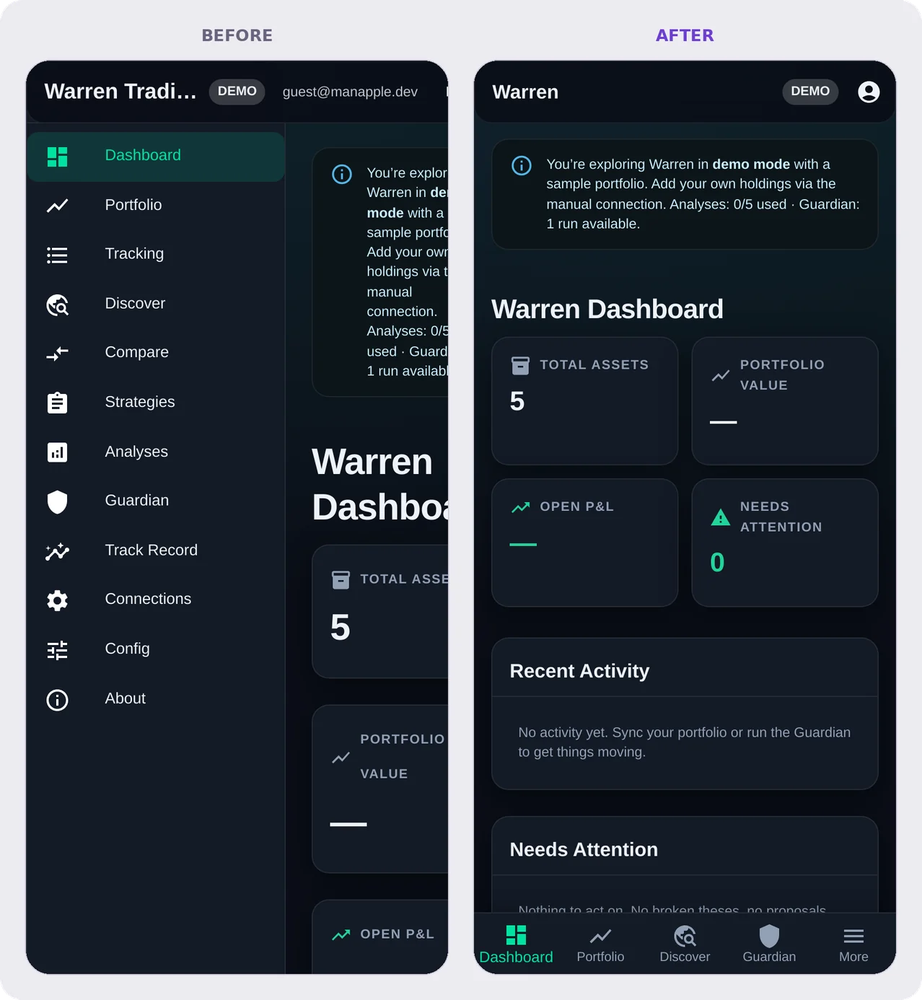
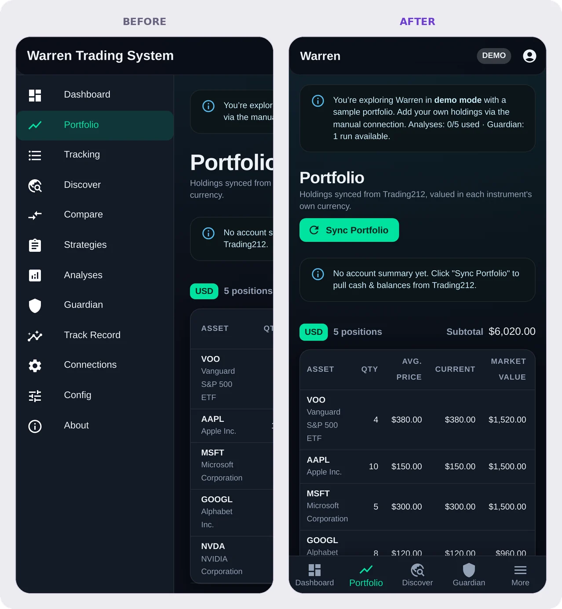
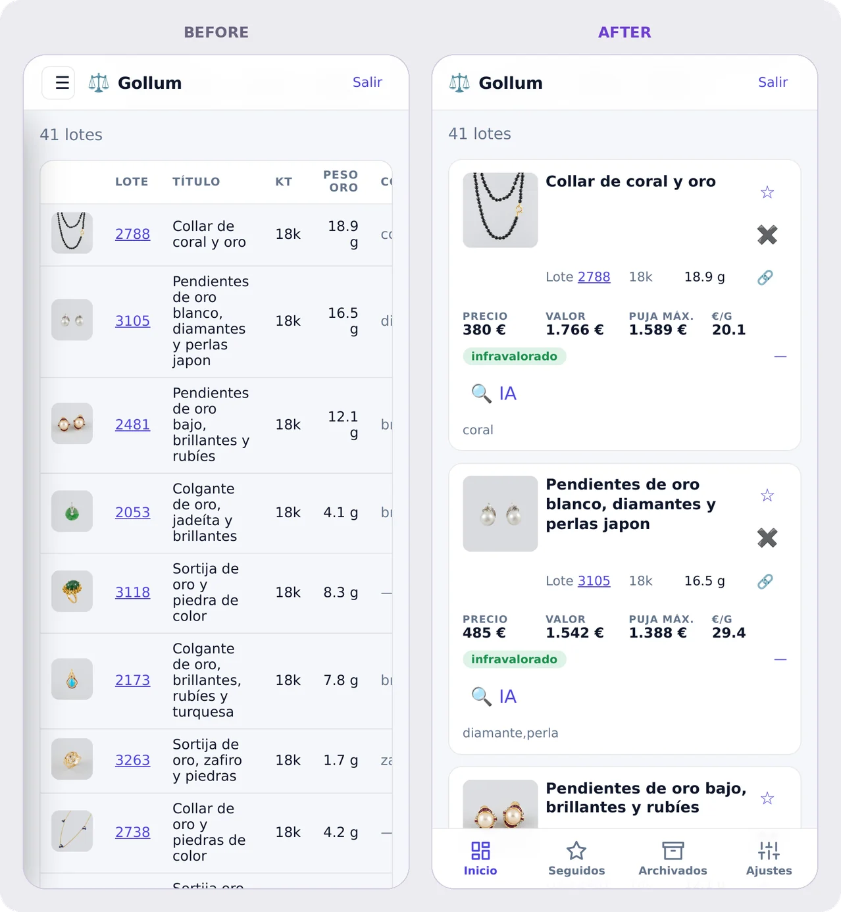
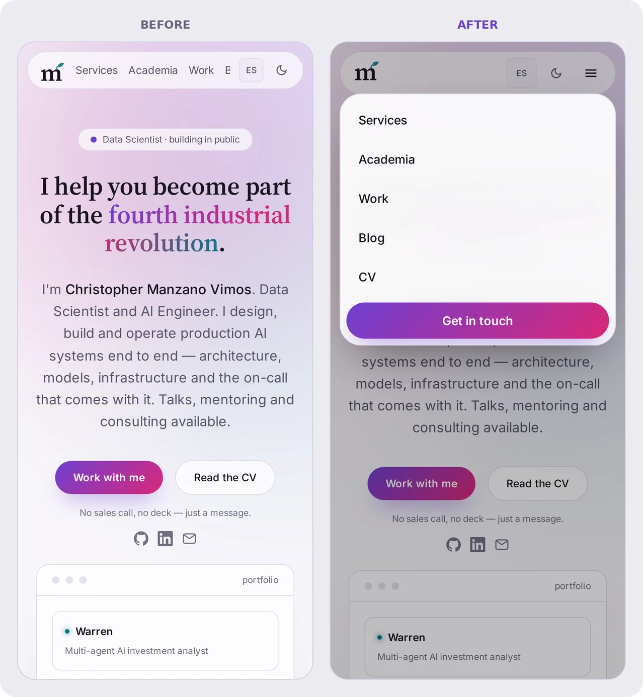

I build everything on a big screen. Almost nobody will use it that way. The
people I expect to open **warren**, **gollum** or this site will mostly do it on
*a phone*, for thirty seconds between two other things.

So I did what I should have done on day one: I opened every page of every app
at phone width and looked. It was not good.

## How broken, exactly

Eyeballing a few screens gives you a feeling. I wanted a number, so I wrote a
small audit with headless Chromium. It loads each page at **360 px** (a typical
Android) and **390 px** (a current iPhone), with touch and mobile emulation on,
and checks one blunt thing: is the page wider than the screen? If
`document.documentElement.scrollWidth` is bigger than the viewport, the page
scrolls sideways, and that is always a bug. The audit also counts touch targets
under 24 px and form fields with text under 16 px, and takes a screenshot of
every page.

The results, before:

- **warren** failed on *every* page. The Guardian page was **2,084 px wide** on a
  390 px phone, more than five screens across.
- **gollum** didn't overflow, but only because its 16-column table was squeezed
  into a scroll box. Each lot took up half the screen and still hid most of its
  columns.
- **this site** looked fine until you noticed that "Blog" and "CV" were missing
  from the menu. The link row scrolled sideways inside the header, with nothing
  to tell you it could.

## warren: the sidebar that ate the screen

warren had a permanent 240 px sidebar, which is lovely on a desktop and leaves
150 px for content on a phone. Everything else followed from there: cards
crushed to one word per line, tables clipped, the header pushed off the right
edge.

The fix follows Material 3's *adaptive navigation* guidance, which is the
closest thing to a consensus we have. Navigation depends on the size of the
window, not on the device:

- **Wide screens** keep the permanent sidebar.
- **Phones** get a **bottom navigation bar** with the four main sections
  (Dashboard, Portfolio, Discover, Guardian), within reach of a
  thumb. A fifth tab, **More**, slides in the full list as a drawer.
- The email address and the logout button, which don't fit in a phone's app
  bar, move into an account menu.

Twelve menu items in a bottom bar would be unusable. Twelve in a hamburger menu
would hide the four that matter most. Four plus "More" is the honest version.

The sidebar was only half the problem. The other half was one line of CSS that
explains more mobile bugs than anything else I know:

> A flex child's minimum width defaults to the width of its content.

So a wide table inside the main column made the main column itself wide, and the
whole page with it. `min-width: 0` on the content column fixed it on every page
at once. Wide tables now scroll inside their own box, and the page stays put.
After that it was a sweep of small defaults at the theme level, so no page has
to remember them:

- Row stacks and page headers **wrap** instead of overflowing.
- Button labels stay on **one line**.
- Long chips, such as an AI-written one-paragraph risk posture that used to be
  1,750 px wide, now wrap inside the chip.
- Tabs scroll sideways.
- Headings shrink on small screens.

## gollum: tables are not a phone interface

gollum tracks lots at a jewellery auction house, and its home page is a table
with sixteen columns: photo, lot number, title, carat, gold weight, gemstones,
price per gram, price, estimated value, status, the AI verdict, maximum bid,
countdown, a link and two actions. On a desktop that is the right tool. On a
phone, no amount of horizontal scrolling makes sixteen columns readable.

Below 700 px each row now **reflows into a card**, with no JavaScript and no
second template. The same `<tr>` becomes a CSS grid with named areas: the photo
and title on top, the lot number, carat and weight under the title, then the
four numbers you actually decide on (price, estimated value, maximum bid, € per
gram), each with a small caption from a `data-label` attribute. Status,
countdown and the AI verdict go at the bottom. The follow and dismiss buttons
sit where a right thumb lands, at 40 px or more.

gollum only has four views, so its sidebar became a **bottom tab bar** too, and
the hamburger button went away.

## this site: menus you can see

The portfolio's header had the opposite problem: it tried so hard to fit that it
hid things. On phones the links now live in a proper menu. It uses the
**Popover API**, which gives you the top layer, closing on a tap outside and
closing with Escape without a line of JavaScript. The only script left closes
the menu when you tap an in-page link like *Work*.

## The rules I'm keeping

**newton** needed only polish: code blocks in its generated summaries now scroll
inside their panel, and quiz answers are proper 44 px buttons. The SSO login and
the silena page already passed. That makes four apps fixed and two confirmed,
with **26 pages** that now pass the audit at both widths. Most of the
work came down to a few rules, which now live in a checklist every new app has
to pass:

1. **No page may scroll sideways.** Check it automatically, at 360 and 390 px,
   on every page.
2. **Navigation depends on the window size.** Use a bottom bar (plus "More")
   on phones and a sidebar on wide screens, never a hidden row of links.
3. **Tables become cards** when they have more columns than a phone can show;
   otherwise they scroll inside their own container, and every flex parent gets
   `min-width: 0`.
4. **Touch targets are at least 44 px.** WCAG 2.2's floor is 24 px, and
   thumbs are wider than that.
5. **Form fields use 16 px text** on touch screens. Below that, iOS zooms the
   whole page when you tap into a field, and it never quite zooms back.
6. **Respect the hardware**: use `100dvh` rather than `100vh`, so the address
   bar doesn't cause layout jumps, and pad fixed bars with
   `env(safe-area-inset-*)` for notches and gesture bars.

None of this is new, which is the point. The techniques have been well
established for years. What was missing was simply looking at the product the
way people use it.

## One more thing: a logo that sits where it looks like it sits

While I was taking these screenshots, I noticed that the little *m* in the
phone header seemed to hang below everything else, and in the home-screen icon
it sat under the middle.
The symbol was centred mathematically, as one box around the *m* and its sprout.
But the sprout is thin and light, so the eye ignores it, and what you see is an
*m* sitting low and to the left.

The fix is *optical* centring. The symbol is now centred on the body of the *m*,
nudged only 30% of the way toward the sprout, and the sprout rises into the top
margin. It's a change of a few pixels that your eye notices even when you
can't say why, which is true of most of this post.
